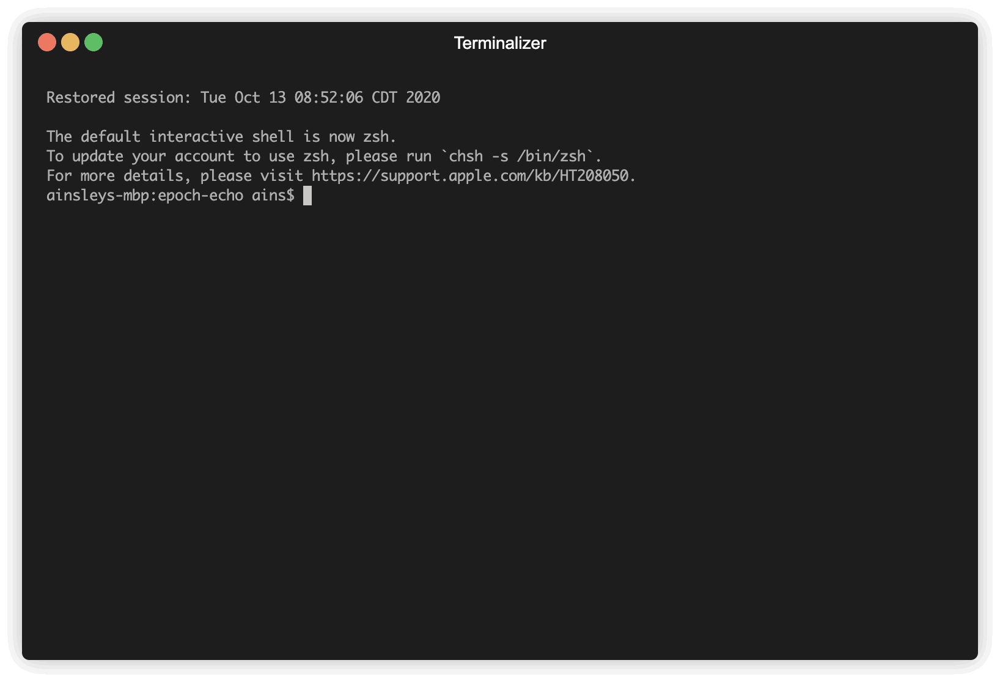

# epoch-echo

A minimal command line alternative to tools like [this](https://www.epochconverter.com).

Built with ✨and [typer](https://github.com/tiangolo/typer).

## About

Born from the grumblings of a crunchy shell-dweller, `ee-cli` is designed to fit nicely in a terminal-heavy workflow with tools like [tmux](https://github.com/tmux/tmux/wiki), [hub](https://github.com/github/hub), [fzf](https://github.com/junegunn/fzf), etc. (This and all my cli tools are inspired by these and others.)

`ee` stands for "epoch echo" because that's sort of what the tool does.

The 2 commands both take inputs as either epoch timestamps or datetimes and print them back as the opposite. `ee` uses [pendulum](https://pendulum.eustace.io) for these conversions. By default, `ee` supports the [same datetime formats](https://pendulum.eustace.io/docs/#rfc-3339) as `pendulum.parse`.

Copypasta your machine-flavored datetimes from the db or whatever into the `ee repl` interface, and ahhhh 😌 a nice human date right there for you in 0 clicks 🌚. Pass a whole long list of some ridiculous mixture of epoch dates and readable datetimes to `ee flip` and witness 🙀 the grand switcharoo 🎠

## Installation

Currently available on PyPi Test only.

```shell
# use 'extra' instead of regular index url bc some deps are not on pypi test
pip install --extra-index-url https://test.pypi.org/simple/ ee-cli
```

The executable is `ee`

```shell
ee # display help and list commands
```

# Usage

Interactive (`ee repl`):



Non-interactive (`ee flip`):


Gifs courtesy of [terminalizer](https://github.com/faressoft/terminalizer).

See [USAGE.md](./USAGE.md) for more
