# epoch-echo

A minimal command line alternative to tools like [this](https://www.epochconverter.com).

Copypasta your machine-flavored datetimes from the db or whatever into the `ee`  and ahhhh 😌 a nice human date right there for you in 0 clicks 🌚. Pass a whole long list of some ridiculous mixture of epoch timestamps and readable datetimes and witness 🙀 the grand switcharoo 🎠

Built with ✨and [typer](https://github.com/tiangolo/typer).

## About

Born from the grumblings of a crunchy shell-dweller, `ee-cli` is designed to fit nicely in a terminal-heavy workflow with tools like [tmux](https://github.com/tmux/tmux/wiki), [hub](https://github.com/github/hub), [fzf](https://github.com/junegunn/fzf), etc. Those tools and their peers inspired `ee` greatly.

`ee` stands for "epoch echo" because that's sort of what the tool does.

`ee` takes any arbitrary combination of  epoch timestamps, datetimes, times, dates, etc, and prints them back as the opposite. `ee` uses [pendulum](https://pendulum.eustace.io) for these conversions.

By default, `ee` supports input from the [same datetime formats](https://pendulum.eustace.io/docs/#tokens) as `pendulum.parse`, plus the conveniences of "now," "tomorrow," "today," and "yeterday."

More input formats can be used by setting the `EXTRA_DATETIME_INPUT_FORMATS` environment variable to a json array of [these tokens](https://pendulum.eustace.io/docs/#tokens) in pendulum

## Installation

This is a Python project, so you install it from pip.

```shell
pip install ee-cli
```

The executable is `ee`

```shell
ee  # display help and list commands
```

# Usage

Basic: Convert a list of datetimes, output it to the clipboard.


Interactive: Use the repl to curate a list of converted datetimes, view help, send to clipboard, and more!



Images generated with [termtosvg](https://github.com/nbedos/termtosvg).

See [USAGE.md](./USAGE.md) for more.
